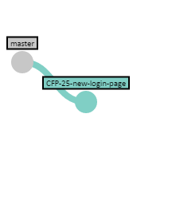

# git development workflow


## git-rebase-squash

We call our development workflow with git **git-rebase-squash**, because of the steps that it involves. It is based on the git branching workflow (just called "git workflow") and it has been adjusted, simplified at some points, emphasized the process in other points.

Even if you know nothing about it, feel free to read below to discover how we work with it.

<br clear="both" />

## The team

The workflow will go through a few days of work of a fictional team, that is composed of:

- **D**imitri (Developer). He's in charge of making the changes to the system that will meet the requirements and design guidelines.
- **T**anya **L**ancaster (TL, Technical Lead). She ensures the technical quality of the project and sets the overal design direction that the project should take.
- **P**aul **R**udd (Peer Reviewer). He's also a developer in the project. He does movies in his spare time.
- **P**rakash **M**anorama (PM, Project Manager). He makes sure the expectations of the customer are met and makes sure the team has all the tools it needs to execute its magic.

## Assignment starts: tickets and branching

_(Takeaways: branch-per-feature, branch naming, tracking tickets)_

Prakash checks with Tanya and they decide that Dimitri should work on the new login page of the customers project. They meet on the subject on their own or with the whole team (maybe in a sprint planning? -- see the [Scrum Workflow](../scrum-workflow/README.md)). Prakash makes sure that Dimitri has a ticket to track his progress: `CFP-25`.

Dimitri will read, ask questions and take notes on his task. Once ready, he'll start working in a branch. All the code that he does needs to be isolated from the rest of the system, in case he needs to change assignments or break something while he has his work in progress.

```console
git checkout -b CFP-25-new-login-page
```



The `CFP-25` portion helps finding that particular branch between a lot other branches. The rest of the branch name is to make it easier to see, or to add more branches for the same ticket (for example, bug fixes or adjustments that require a branch of their own).

<br clear="both" />

## Development: commits

_(Takeaways: commits messages, testing)_

<!-- TODO: Complete -->

## Work is done: pull request

_(Takeaways: code reviews, pull request updates)_

<!-- TODO: Complete -->

## Work is approved: ready to merge

_(Takeaways: rebase, squash merge, commit message)_

<!-- TODO: Complete -->