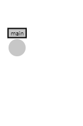
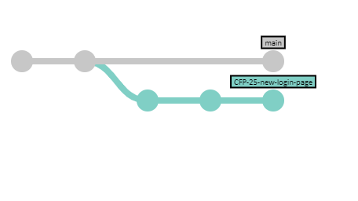

# git development workflow


## git-rebase-squash

We call our development workflow with git **git-rebase-squash**, because of the steps that it involves. It is based on the git branching workflow (just called "git workflow") and it has been adjusted, simplified at some points, emphasized the process in other points.

Even if you know nothing about it, feel free to read below to discover how we work with it.

If you want some guidelines on what rules to follow for git usage, you should read our guideline on [git conventions](conventions.md)

<br clear="both" />

## The team

The workflow will go through a few days of work of a fictional team, that is composed of:

- **D**imitri (Developer). He's in charge of making the changes to the system that will meet the requirements and design guidelines.
- **T**anya **L**ancaster (TL, Technical Lead). She ensures the technical quality of the project and sets the overal design direction that the project should take.
- **P**aul **R**udd (Peer Reviewer). He's also a developer in the project. He does movies in his spare time.
- **P**rakash **M**anorama (PM, Project Manager). He makes sure the expectations of the customer are met and makes sure the team has all the tools it needs to execute its magic.

## Assignment starts: tickets and branching

_(Takeaways: branch-per-feature, branch naming, tracking tickets)_

Prakash checks with Tanya and they decide that Dimitri should work on the new login page of the customers project. They meet on the subject on their own or with the whole team (maybe in a sprint planning? -- see the [Scrum Workflow](../scrum-workflow/README.md)). Prakash makes sure that Dimitri has a ticket to track his progress: `CFP-25`.

Dimitri will read, ask questions and take notes on his task. Once ready, he'll start working in a branch. All the code that he does needs to be isolated from the rest of the system, in case he needs to change assignments or break something while he has his work in progress.

But first! He needs to make sure he'll start from the latest version of the code.

```console
git checkout master
git pull origin master
```



With the first command, Dimitri made sure he was "standing" on the `master` branch, the branch where the latest valid version of the code is. This is where other developers have the accepted code, so he doesn't want to miss the latest changes.

You can see at the left what the repository looks like: just the `master` branch, which may have some history, but we'll start from this point.

<br clear="both" />

From here, the next step is to add a new branch, one from which Dimitri's changes will live independently of the rest of the changes, to avoid conflicts.

```console
git checkout -b CFP-25-new-login-page
```


Note that while now Dimitri has a branch starting off from `master`, there are no extra changes from him. Even if he hasn't commited, every pending change is now in his local work folder.

Regarding the branch name, the `CFP-25` portion helps finding that particular branch between a lot other branches. The rest of the branch name is to make it easier to see, or to add more branches for the same ticket (for example, bug fixes or adjustments that require a branch of their own).

<br clear="both" />


Also note that this may be repeated any amount of times.

While Dimitri is working on his changes, Paul has also started with changes of his own. You can see those listed in a new branch, `CFP-26-rework-styles`. We don't know what Paul is doing in detail, but with this information, we know enough to find it out. However, let's stick with Dimitri.

<br clear="both" />

## Development: commits

_(Takeaways: commits messages, testing)_

Dimitri will start making changes to files in his local repository. Every once in a while, he'll reach a state of some progress, a state that he'd like to remember in case something goes wrong later.

So, Dimitri decides to _commit_ his changes so far. And he does this multiple times, as he keeps making progress.


This will continue until Dimitri is done with his changes, which may take one or a million commits. It's fine, he doesn't need to worry about other changes in the code, since he's the only one working on his branch.

It is important, however, that the commit messages explain correctly what changes are being introduced into the code. This will help go back in time or review certain changes if it's required to debug some problems. A message like `work in progress` helps no one, but a message like `Adjusted main page styles` is a lot more descriptive.

<br clear="both" />

## Work is done: pull request

_(Takeaways: rebase, code reviews, reviewers)_

Now that Dimitri is done, he'll send the changes for his team to review what he has done. It's not that he's not good at development (he's excellent), but four eyes are better than two. Also, there are aspects around the technical direction of the project that he may not be aware of.

Best case scenario, everything will be perfect and accepted and he will be able to merge his code into the `master` branch. But wait! Turns out that Paul already integrated his changes, so now `master` is not what we started with!

In order to verify this, Dimitri will bring back again the latest changes from the repository:

```console
# either by doing a pull on master
git pull origin master

# or by fetching all branches from the remote repository
# using prune to delete old branches that don't exist anymore
git fetch origin --prune
```



This being the case, Dimitri will have to re-base his changes. This is, changing the base of his changes so that his commits start from the new latest version of `master`.

```console
git rebase master
```

This will take him through a process of rewinding back to the first commit that both branches share, and re-playing the commits on top of the new `master`. Good this is all automatic!

Dimitri will only have to intervene if there are any conflicts. If this happens, it means that a particular commit made a change where the other branch had already made changes, so Dimitri will have to make the decision on what's the final truth.

After fixing one of those conflicts and making sure that the commit is now how it should have been, he can proceed with the rebase operation until it finishes:

```console
git rebase --continue
```


Finally! Now we're really ready! What reviewers will have to review is all the new work that Dimitri did. This means, that if while creating the pull request, more than three commits appear, something was wrong with the rebase.

### Creating the pull request

Now it's time to send the pull request. Dimitri creates one where he explains what changes he did and why he made the choices that he made. Also, brings particular attention of the reviewers to whatever he feels is more important, risky, or has his doubting. He includes both Tanya (because she's his TL) and Paul (because he'll also have to support this code). Refer to this article for some tips on [creating good pull requests](https://blog.alphasmanifesto.com/2016/07/11/how-to-create-a-good-pull-request/).

While they're reviewing the changes, Dimitri could start with another piece of work (after all, branches are isolated!). Or sip some deserved coffee. Dimitri should contact Prakash and ask what the next priority is to make the best use of his time.

## Changes are requested

_(Takeaways: pull request updates)_

Turns out that both Tanya and Paul found elements that they're not sure about. Sometimes they suggested changes, sometimes they asked questions that need to be investigated or discussed before they can be actionable. Both Tanya and Paul try to keep it focused so that it's easy to make decisions. Dimitri does code reviews too for code that he has not written, so he knows how this goes. Refer to this article for some tips on [providing good feedback on pull requests](https://blog.alphasmanifesto.com/2016/11/17/how-to-perform-a-good-code-review/).

When decisions are made, all that Dimitri has to do is add new commits to his branch, and they will be showing in the PR. Platforms like GitHub or Bitbucket will hide comments that are no longer applicable, so be mindful about that!

In the case where `master` has already advanced again, Dimitri will rebase it again. It's his responsibility that reviewers are watching the actual difference that will be applied to the code, and if the base branch is wrong, then he's lying to his team.

## Work is approved: ready to merge

_(Takeaways: rebase, squash merge, commit message)_

At some point, both Tanya and Paul are ok with Dimitri's changes. If Dimitri is responsible for merging the code (this depends on the responsibilities of each project), he'll perform a squash merge.

A squash merge takes a set of changes (commits) and squashes them into a single commit. GitHub already has that feature integrated into their pull request screen, but BitBucket doesn't. In any case, Dimitri is really comfortable with the console so he proceeds with the commands.


```console
git checkout master
git merge --squash CF-25-new-login-page
git push origin master
```

At this point, `master` has a new commit with the contents from the `CF-25-new-login-page` branch, so the merge is done! But wait, there is still that branch lingering around, and we don't need it anymore.


This looks a lot like the case where our branch needed to be rebased, but in this case, the changes are already part of the `master` branch, so we don't care about the feature branch anymore.

Dimitri proceeds to delete his feature branch:

```console
# delete the branch on the repository
git push --delete origin CF-25-new-login-page

# delete the branch locally
git branch -D CF-25-new-login-page
```


Dimitri contacts Prakash and lets him know that he's done with his task and asks for a new assignment in case he does not have one already.

And that's it! Rinse and repeat!

# Recap

Here's a quick rundown of the steps Dimitri did:

- Get latest changes
- Start a new branch (`git checkout -b featureBranch`)
- Perform his changes
- Get latest, move his work on top of the latest (`git rebase master`)
- Create a pull request
- Perform corrections as needed
- Get latest, squash-merge his changes on the destination branch (`git merge --squash featureBranch`)
- Delete the feature branch (`git push --delete origin featureBranch; git branch -D featureBranch`)